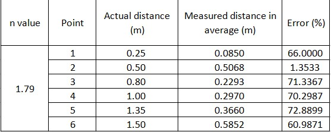

# ESP8266_DistanceMeasure_RSSI
This project include 2 smaler projects: The WifiAP and the Client. The WifiAP will broacast it's Wifi to the Client. 
The Client will measure the RSSI and convert it to distance.
The Client board I used is ESP8266 Mini, and the WifiAP board I used is ESP8266 Node MCU. 
Though, you can switch in reverse or use both ESP8266 mini or Node MCU because they use the same chip.

# Discription
+ After loading the code, the ESP8266 that loaded the Client's program will start the calibration. Follow the instruction send via COM port that the board is connecting.
+ The calibration includes 2 steps:
  + Step 1: Place 2 board exactly 1 meter apart then press '1' to start the calibration.
  + Step 2: Place 2 board exactly 0.5 meter (50 cm) then press '1' to continue the calibration.
+ The result is not greate. Error can go up to over 70 % as the picture below. So basicly, this project is just for fun.

+ These projects are made on VS Code and PlatformIO.

# Youtube Channel
+ You can watch this project's video on Youtube: https://youtu.be/Ao4Izj3wiyg
+ If you can, please support me on my Youtube's channel: @ElectricalThinking29.

# License
Copyright 2023 @ElectricalThinking29

Licensed under the Apache License, Version 2.0 (the "License");
you may not use this file except in compliance with the License.
You may obtain a copy of the License at

    http://www.apache.org/licenses/LICENSE-2.0

Unless required by applicable law or agreed to in writing, software
distributed under the License is distributed on an "AS IS" BASIS,
WITHOUT WARRANTIES OR CONDITIONS OF ANY KIND, either express or implied.
See the License for the specific language governing permissions and
limitations under the License.

